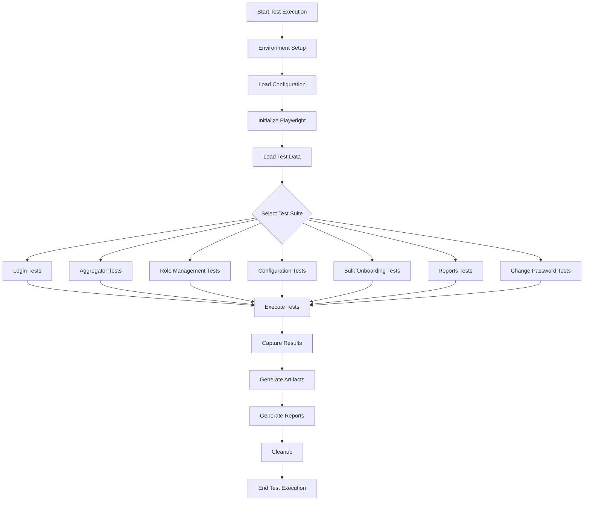
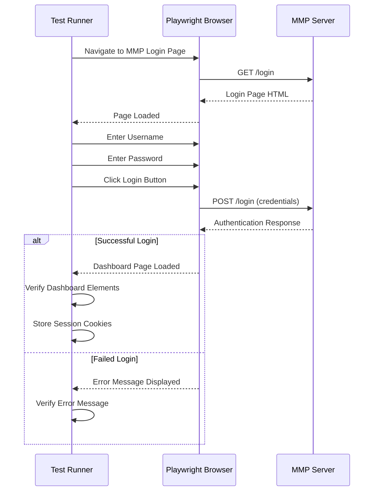
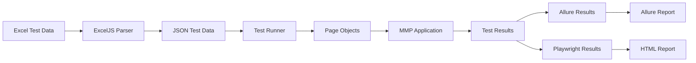
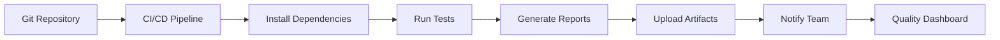
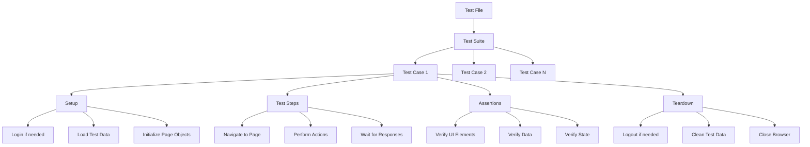
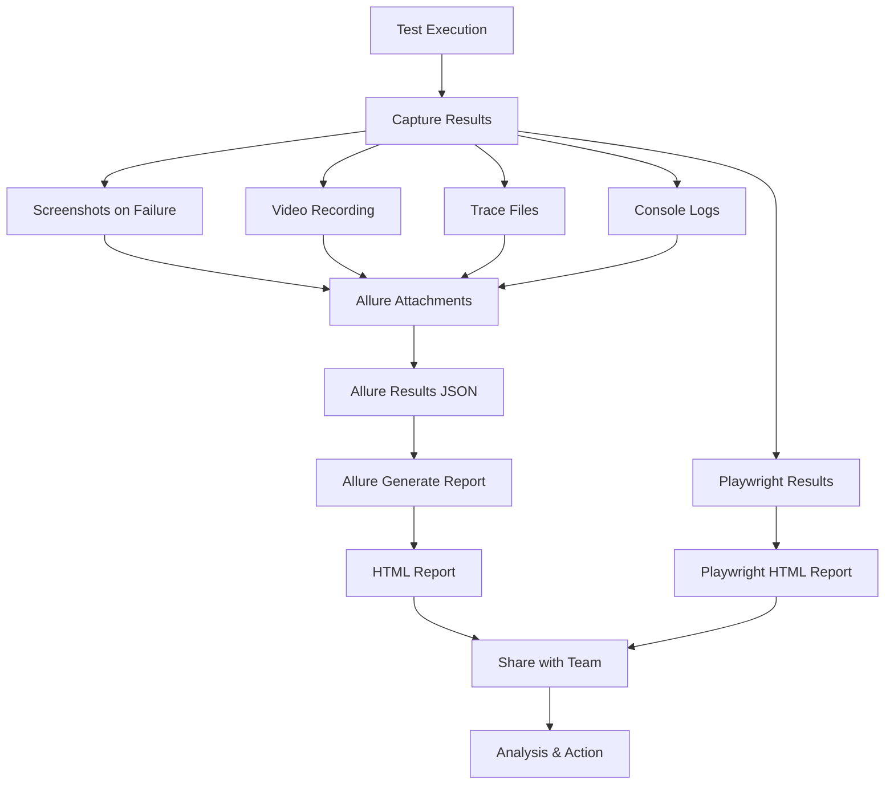
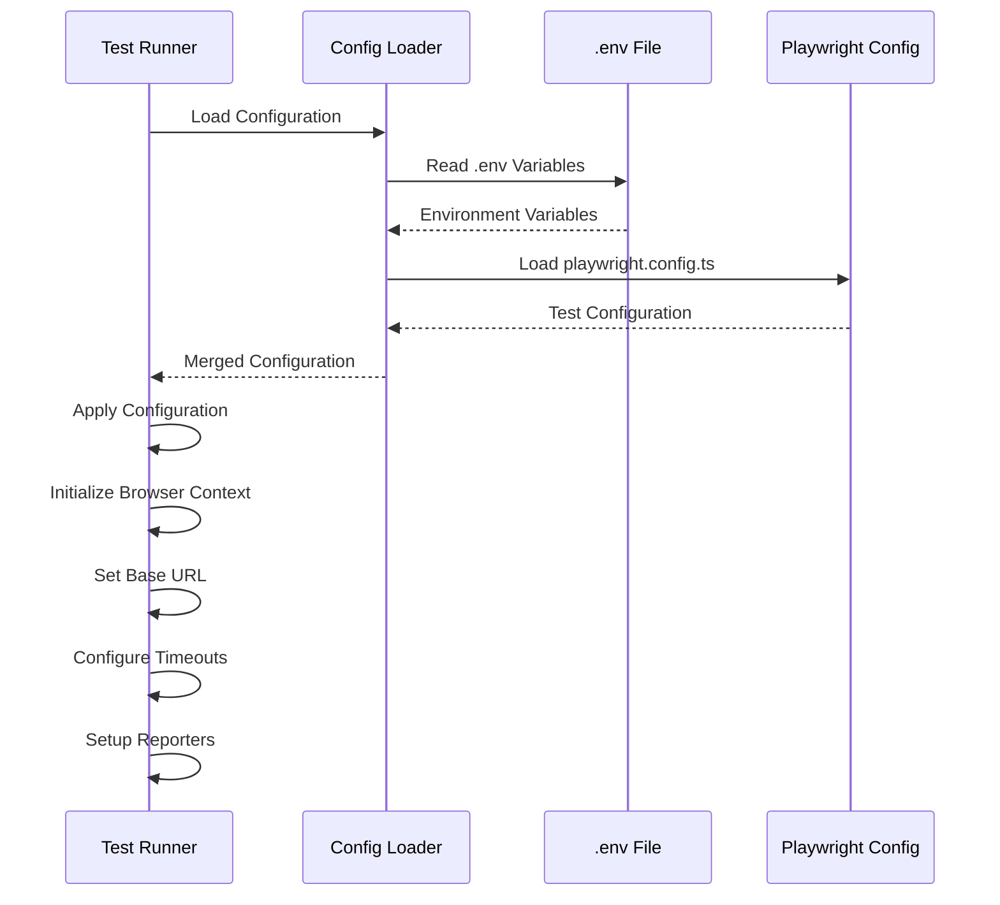
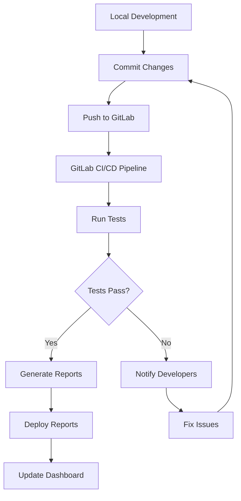
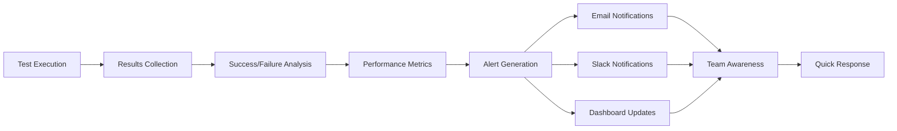

# AXIAN Automation Testing Framework - Flow Diagram

## 🎯 Overall Test Execution Flow

## 🔐 Login Flow

## 👥 User Role-Based Test Flow

```mermaid
graph TB
    subgraph "Admin Maker Workflow"
        AM1[Login as Admin Maker] --> AM2[Navigate to Admin Panel]
        AM2 --> AM3[Create New Aggregator]
        AM3 --> AM4[Fill Aggregator Details]
        AM4 --> AM5[Submit for Approval]
        AM5 --> AM6[Verify Pending Status]
        
        AM2 --> AM7[Create New Role]
        AM7 --> AM8[Define Role Permissions]
        AM8 --> AM9[Submit Role for Approval]
        
        AM2 --> AM10[Configure System Settings]
        AM10 --> AM11[Save Configuration]
        
        AM2 --> AM12[Initiate Bulk Onboarding]
        AM12 --> AM13[Upload Excel File]
        AM13 --> AM14[Validate Data]
        AM14 --> AM15[Submit for Processing]
    end
    
    subgraph "Admin Checker Workflow"
        AC1[Login as Admin Checker] --> AC2[Review Pending Requests]
        AC2 --> AC3{Approve/Reject?}
        AC3 -->|Approve| AC4[Approve Request]
        AC3 -->|Reject| AC5[Reject with Comments]
        AC4 --> AC6[Verify Approval Status]
        AC5 --> AC7[Verify Rejection Status]
    end
    
    subgraph "Labesh Maker Workflow"
        LM1[Login as Labesh Maker] --> LM2[Access Labesh Module]
        LM2 --> LM3[Create Labesh Entry]
        LM3 --> LM4[Submit for Verification]
    end
    
    subgraph "Labesh Checker Workflow"
        LC1[Login as Labesh Checker] --> LC2[Verify Labesh Entries]
        LC2 --> LC3{Approve/Reject?}
        LC3 -->|Approve| LC4[Approve Labesh]
        LC3 -->|Reject| LC5[Return for Correction]
    end
```

## 📊 Test Data Flow

## 🔄 Test Execution Pipeline

## 🧪 Test Case Structure

## 📈 Reporting Flow

## 🔧 Configuration Flow

## 🚀 Deployment Flow

## 📋 Key Test Scenarios

### 1. **Login Tests**
- Valid credentials login
- Invalid credentials login
- Password reset flow
- Session management

### 2. **Aggregator Management**
- Create new aggregator
- Update existing aggregator
- Delete aggregator
- Approve/reject aggregator
- Search and filter aggregators

### 3. **Role Management**
- Create user roles
- Assign permissions
- Update role permissions
- Delete roles
- Role-based access control

### 4. **Configuration Management**
- System settings configuration
- Business rules setup
- Parameter management
- Configuration validation

### 5. **Bulk Onboarding**
- Excel template download
- Data validation
- Bulk upload processing
- Error handling
- Status tracking

### 6. **Reports**
- Report generation
- Report filtering
- Export functionality
- Report scheduling

### 7. **Change Password**
- Password change flow
- Password policy validation
- Session handling after password change

## 🔍 Monitoring & Alerting

This flow diagram provides a comprehensive overview of the automation testing framework architecture, execution flow, and integration points.