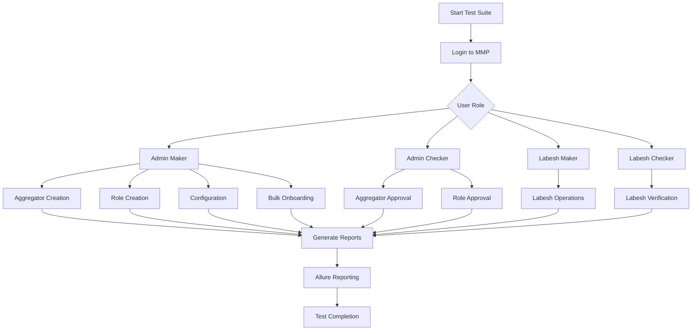

# AXIAN Automation Testing Framework

A comprehensive Playwright-based automation testing framework for MMP (Mobile Money Platform) web application testing.

## 📋 Project Overview

This automation testing framework is built with:
- **Playwright**: For end-to-end testing
- **TypeScript**: For type-safe test development
- **Allure**: For test reporting and visualization
- **ExcelJS**: For data-driven testing with Excel files

## 🚀 Features

- **Multi-role testing**: Admin Maker, Admin Checker, Labesh Maker, Labesh Checker workflows
- **Comprehensive test coverage**: Login, Aggregator management, Role management, Configuration, Bulk onboarding, Reports
- **Data-driven testing**: Excel-based test data management
- **Detailed reporting**: Allure reports with screenshots, videos, and traces
- **Parallel execution**: Configurable test execution
- **Environment configuration**: Support for multiple environments via .env files

## 📁 Project Structure

```
AXIAN_AUTOMATION_TESTING/
├── tests/                    # Test specifications
│   └── mmp/                 # MMP-specific tests
│       ├── login.spec.ts
│       ├── aggregatorE2E.spec.ts
│       ├── aggregatorNegative.spec.ts
│       ├── aggregatorUpdate.spec.ts
│       ├── roleCreation.spec.ts
│       ├── config.spec.ts
│       ├── bulkOnboarding.spec.ts
│       ├── changePassword.spec.ts
│       ├── reports.spec.ts
│       ├── adminMaker/      # Admin Maker role tests
│       ├── adminChecker/    # Admin Checker role tests
│       ├── labeshMaker/     # Labesh Maker role tests
│       └── labeshChecker/   # Labesh Checker role tests
├── pages/                   # Page Object Models
│   └── mmp/                # MMP page objects
├── utils/                   # Utility functions
│   ├── generateLoginReport.ts
│   ├── generateAggregatorReport.ts
│   ├── generateAggregatorUpdateReport.ts
│   ├── generateConfigReport.ts
│   ├── generateChangePasswordReport.ts
│   ├── generateBulkOnboardingReport.ts
│   └── generateMasterReport.ts
├── test-data/              # Test data files (Excel, JSON)
├── test-results/           # Test execution results
├── allure-results/         # Allure test results
├── allure-report/          # Generated Allure reports
├── playwright-report/      # Playwright HTML reports
├── reports/                # Custom reports
├── .env                    # Environment variables
├── playwright.config.ts    # Playwright configuration
├── package.json           # Dependencies and scripts
└── tsconfig.json          # TypeScript configuration
```

## 🛠️ Setup Instructions

### Prerequisites
- Node.js (v16 or higher)
- npm or yarn
- Git

### Installation

1. Clone the repository:
```bash
git clone <repository-url>
cd AXIAN_AUTOMATION_TESTING
```

2. Install dependencies:
```bash
npm install
```

3. Install Playwright browsers:
```bash
npx playwright install
```

4. Configure environment variables:
```bash
cp .env.example .env
# Edit .env file with your configuration
```

### Environment Variables
Create a `.env` file with the following variables:
```env
MMP_BASE_URL=https://mixxmmp-test.tigo.co.tz
MMP_USERNAME=your_username
MMP_PASSWORD=your_password
# Add other environment-specific variables
```

## 🧪 Running Tests

### Individual Test Suites
```bash
# Run login tests
npm run test:login

# Run aggregator tests
npm run test:aggregator

# Run role creation tests
npm run test:roleAll

# Run configuration tests
npm run test:configAll

# Run bulk onboarding tests
npm run test:bulkAll

# Run reports tests
npm run test:reports

# Run change password tests
npm run test:changePassword
```

### Run All Tests
```bash
npm run test:all
```

### Run with UI Mode
```bash
npm run test:ui
```

### Run with Headed Browser
```bash
npm run test:headed
```

## 📊 Generating Reports

### Allure Reports
```bash
# Generate Allure report
npm run allure:generate

# Open Allure report
npm run allure:open
```

### Custom Reports
```bash
# Generate login report
npm run report:login

# Generate aggregator report
npm run report:aggregator

# Generate master report
npm run report:all
```

### Playwright HTML Report
```bash
npm run report
```

## 🔧 Test Development

### Code Generation
Generate test code using Playwright's codegen:
```bash
npm run codegen
```

### Adding New Tests
1. Create test file in `tests/mmp/` directory
2. Follow existing test patterns
3. Add page objects in `pages/mmp/` if needed
4. Add test data in `test-data/` directory
5. Add npm script in `package.json`

### Page Object Model
The framework uses Page Object Model pattern:
- Page objects in `pages/mmp/`
- Each page object contains locators and actions
- Tests import and use page objects

## 📈 Test Flow Diagram



## 🤝 Contributing

1. Fork the repository
2. Create a feature branch
3. Write tests following existing patterns
4. Ensure all tests pass
5. Submit a pull request

## 📝 Best Practices

1. **Use Page Object Model**: Keep locators and actions in page objects
2. **Data-driven tests**: Use Excel files for test data
3. **Independent tests**: Each test should be independent
4. **Proper assertions**: Use meaningful assertions
5. **Clean test data**: Clean up test data after tests
6. **Meaningful test names**: Use descriptive test names
7. **Proper reporting**: Add screenshots and videos on failure

## 🐛 Troubleshooting

### Common Issues

1. **Tests failing with timeout errors**:
   - Increase timeout in playwright.config.ts
   - Check network connectivity
   - Verify environment variables

2. **Allure reports not generating**:
   - Ensure allure-playwright is installed
   - Check allure-results directory exists
   - Run `npm run allure:generate` after tests

3. **Excel file issues**:
   - Ensure ExcelJS is installed
   - Check file paths in test data
   - Verify Excel file format

### Debugging
- Run tests in UI mode: `npm run test:ui`
- Run tests in headed mode: `npm run test:headed`
- Check test-results directory for artifacts
- Review allure-results for detailed logs

## 📄 License

ISC License

## 👥 Authors

- Automation Testing Team

## 🔗 Useful Links

- [Playwright Documentation](https://playwright.dev/docs/intro)
- [Allure Playwright Integration](https://github.com/allure-framework/allure-js/tree/master/packages/allure-playwright)
- [TypeScript Documentation](https://www.typescriptlang.org/docs/)
- [ExcelJS Documentation](https://github.com/exceljs/exceljs)