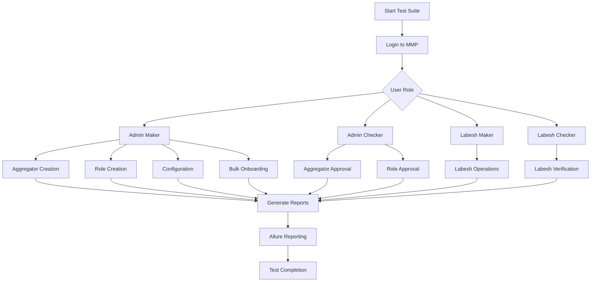

# LKS AXIAN Automation Testing Framework

Automated testing framework for LKS AXIAN platform using Playwright and TypeScript.

## 📋 Overview

This project provides comprehensive automated test coverage for the LKS AXIAN platform, including:
- User authentication and login flows
- Payment processing (bank transfers, bill payments, cashouts)
- Money transfer operations
- Wallet-to-bank and wallet-to-wallet scheduled payments
- User profile management (password & MPIN changes)

## 🚀 Features

- **Page Object Model**: Organized page objects for maintainable test code
- **TypeScript Support**: Full TypeScript support for type safety
- **Playwright Framework**: Modern browser automation
- **Test Organization**: Tests organized by feature/module
- **Test Data Management**: Centralized test data configuration
- **GitHub Actions**: CI/CD integration with Playwright workflows

## 📁 Project Structure

```
├── pages/                      # Page object models
│   ├── LoginPage.ts
│   ├── BankTransferPage.ts
│   ├── BillPaymentPage.ts
│   ├── CashoutPage.ts
│   ├── SendMoneyPage.ts
│   ├── SchedulePaymentPage.ts
│   ├── ChangeMpinPage.ts
│   └── ChangePasswordPage.ts
├── tests/                      # Test specifications
│   ├── payments/
│   │   ├── bank-transfer.spec.ts
│   │   ├── bill-payment.spec.ts
│   │   ├── cashout.spec.ts
│   │   ├── schedule-wallet-to-bank.spec.ts
│   │   ├── schedule-wallet-to-wallet.spec.ts
│   │   └── send-money.spec.ts
│   ├── profile/
│   │   ├── change-mpin.spec.ts
│   │   └── change-password.spec.ts
│   ├── example.spec.ts
│   └── merchant-portal.spec.ts
├── data/                       # Test data
│   └── testData.ts
├── test-cases/                 # Test case documents
├── scripts/                    # Utility scripts
├── playwright.config.ts        # Playwright configuration
├── package.json                # Project dependencies
└── playwright-report/          # Test reports (generated)
```

## 🛠️ Installation

### Prerequisites
- Node.js (v16 or higher)
- npm or yarn

### Setup

1. Clone the repository:
```bash
git clone https://github.com/rabbiyamehmood/LKS_AXIAN_AUTOMATION.git
cd LKS_AXIAN_AUTOMATION
```

2. Install dependencies:
```bash
npm install
```

3. Install Playwright browsers:
```bash
npx playwright install
```

## 🧪 Running Tests

### Run all tests:
```bash
npm test
```

### Run tests in a specific directory:
```bash
npm test -- tests/payments/
```

### Run a specific test file:
```bash
npm test -- tests/payments/bank-transfer.spec.ts
```

### Run tests in headed mode (see browser):
```bash
npm test -- --headed
```

### Run tests in debug mode:
```bash
npm test -- --debug
```

### Generate HTML report:
```bash
npx playwright show-report
```

## 📊 Test Categories

### Payment Tests
- **Bank Transfer**: Tests for bank transfer functionality
- **Bill Payment**: Tests for bill payment processes
- **Cashout**: Tests for cash withdrawal operations
- **Send Money**: Tests for money transfer between users
- **Schedule Payments**: Tests for scheduled wallet-to-bank and wallet-to-wallet payments

### Profile Tests
- **Change MPIN**: Tests for MPIN modification
- **Change Password**: Tests for password modification

## 🔧 Configuration

Edit `playwright.config.ts` to customize:
- Browser launch options
- Test timeout settings
- Report generation
- Parallelization settings

Edit `data/testData.ts` for test credentials and test data.

## 📝 Writing Tests

Tests follow the Page Object Model pattern. Example:

```typescript
import { test, expect } from '@playwright/test';
import { LoginPage } from '../pages/LoginPage';

test('User login success', async ({ page }) => {
  const loginPage = new LoginPage(page);
  await loginPage.navigate();
  await loginPage.login('user@example.com', 'password');
  // Add assertions
});
```

## 🤝 Contributing

1. Create a new branch for your feature
2. Write tests following the Page Object Model
3. Ensure all tests pass
4. Submit a pull request

## 📞 Support

For issues or questions, please create an issue in the repository.

## 📄 License

This project is proprietary and confidential.

---

**Last Updated**: 2026-07-06
```bash
# Generate Allure report
npm run allure:generate

# Open Allure report
npm run allure:open
```

### Custom Reports
```bash
# Generate login report
npm run report:login

# Generate aggregator report
npm run report:aggregator

# Generate master report
npm run report:all
```

### Playwright HTML Report
```bash
npm run report
```

## 🔧 Test Development

### Code Generation
Generate test code using Playwright's codegen:
```bash
npm run codegen
```

### Adding New Tests
1. Create test file in `tests/mmp/` directory
2. Follow existing test patterns
3. Add page objects in `pages/mmp/` if needed
4. Add test data in `test-data/` directory
5. Add npm script in `package.json`

### Page Object Model
The framework uses Page Object Model pattern:
- Page objects in `pages/mmp/`
- Each page object contains locators and actions
- Tests import and use page objects

## 📈 Test Flow Diagram



## 🤝 Contributing

1. Fork the repository
2. Create a feature branch
3. Write tests following existing patterns
4. Ensure all tests pass
5. Submit a pull request

## 📝 Best Practices

1. **Use Page Object Model**: Keep locators and actions in page objects
2. **Data-driven tests**: Use Excel files for test data
3. **Independent tests**: Each test should be independent
4. **Proper assertions**: Use meaningful assertions
5. **Clean test data**: Clean up test data after tests
6. **Meaningful test names**: Use descriptive test names
7. **Proper reporting**: Add screenshots and videos on failure

## 🐛 Troubleshooting

### Common Issues

1. **Tests failing with timeout errors**:
   - Increase timeout in playwright.config.ts
   - Check network connectivity
   - Verify environment variables

2. **Allure reports not generating**:
   - Ensure allure-playwright is installed
   - Check allure-results directory exists
   - Run `npm run allure:generate` after tests

3. **Excel file issues**:
   - Ensure ExcelJS is installed
   - Check file paths in test data
   - Verify Excel file format

### Debugging
- Run tests in UI mode: `npm run test:ui`
- Run tests in headed mode: `npm run test:headed`
- Check test-results directory for artifacts
- Review allure-results for detailed logs

## 📄 License

ISC License

## 👥 Authors

- Automation Testing Team

## 🔗 Useful Links

- [Playwright Documentation](https://playwright.dev/docs/intro)
- [Allure Playwright Integration](https://github.com/allure-framework/allure-js/tree/master/packages/allure-playwright)
- [TypeScript Documentation](https://www.typescriptlang.org/docs/)
- [ExcelJS Documentation](https://github.com/exceljs/exceljs)