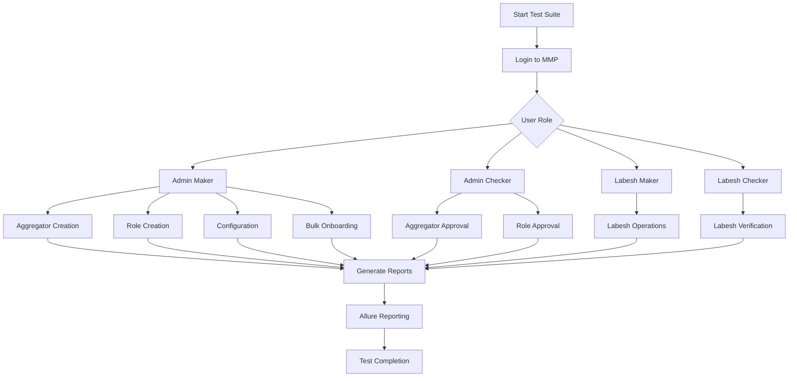

# LKS AXIAN Automation Testing Framework

Comprehensive automated testing framework for **LKS AXIAN Portal** using Playwright and TypeScript.

## 📋 Overview

This automation framework provides end-to-end test coverage for the **LKS Admin Portal**, a centralized management system for:

### Portal Modules
- **Dashboard**: Real-time metrics and overview
- **Incoming Transactions**: Monitor and manage incoming payments
- **Handler Management**: Create, configure, and manage payment handlers
- **Terminal Management**: Register and monitor POS terminals
- **Outgoing Transactions**: Track outgoing payment processes
- **Transactions History**: Historical data and analytics
- **Merchant Hierarchy**: Merchant administration and management
- **Settings**: System configuration and preferences

## 🚀 Features

- **Page Object Model (POM)**: Maintainable and scalable test code structure
- **TypeScript Support**: Full type safety and IDE support
- **Playwright Framework**: Modern, fast, and reliable browser automation
- **Modular Test Organization**: Tests organized by portal modules
- **Test Data Management**: Centralized test data configuration
- **CI/CD Integration**: GitHub Actions workflow support
- **Detailed Reporting**: HTML and Allure test reports with screenshots

## 📁 Complete Project Structure

```
LKS_AXIAN_AUTOMATION/
├── pages/                          # Page Object Models
│   ├── LoginPage.ts                # Portal login page
│   ├── DashboardPage.ts            # Admin dashboard
│   ├── IncomingPage.ts             # Incoming transactions module
│   ├── HandlerManagementPage.ts    # Handler CRUD operations
│   ├── TerminalManagementPage.ts   # Terminal operations
│   ├── OutgoingPage.ts             # Outgoing transactions module
│   ├── TransactionHistoryPage.ts   # Transaction history & search
│   ├── MerchantHierarchyPage.ts    # Merchant management
│   └── SettingsPage.ts             # Portal settings & config
│
├── tests/                          # Test Specifications
│   ├── auth/                       # Authentication tests
│   │   └── login.spec.ts           # Login flow tests
│   │
│   ├── dashboard/                  # Dashboard module tests
│   │   ├── dashboard-load.spec.ts
│   │   ├── dashboard-widgets.spec.ts
│   │   └── dashboard-export.spec.ts
│   │
│   ├── handlers/                   # Handler management tests
│   │   ├── handler-create.spec.ts
│   │   ├── handler-edit.spec.ts
│   │   ├── handler-delete.spec.ts
│   │   └── handler-permissions.spec.ts
│   │
│   ├── terminals/                  # Terminal management tests
│   │   ├── terminal-register.spec.ts
│   │   ├── terminal-configure.spec.ts
│   │   ├── terminal-status.spec.ts
│   │   └── terminal-monitoring.spec.ts
│   │
│   ├── transactions/               # Transaction tests
│   │   ├── incoming-transactions.spec.ts
│   │   ├── outgoing-transactions.spec.ts
│   │   ├── transaction-filters.spec.ts
│   │   └── transaction-history.spec.ts
│   │
│   ├── merchants/                  # Merchant hierarchy tests
│   │   ├── merchant-create.spec.ts
│   │   ├── merchant-edit.spec.ts
│   │   ├── merchant-approval.spec.ts
│   │   └── merchant-hierarchy.spec.ts
│   │
│   └── settings/                   # Settings tests
│       ├── general-settings.spec.ts
│       ├── security-settings.spec.ts
│       └── notification-settings.spec.ts
│
├── data/                           # Test Data
│   ├── testData.ts                 # Credentials & test data
│   ├── handlers.data.ts            # Handler test data
│   ├── terminals.data.ts           # Terminal test data
│   ├── merchants.data.ts           # Merchant test data
│   └── transactions.data.ts        # Transaction test data
│
├── test-cases/                     # Test Case Documents
│   ├── LKS_Dashboard_TestCases.xlsx
│   ├── LKS_Handler_TestCases.xlsx
│   ├── LKS_Terminal_TestCases.xlsx
│   ├── LKS_Transaction_TestCases.xlsx
│   ├── LKS_Merchant_TestCases.xlsx
│   └── LKS_Settings_TestCases.xlsx
│
├── scripts/                        # Utility Scripts
│   ├── generateTestCases.js        # Test case generator
│   ├── generateReport.js           # Report generation
│   └── setupData.js                # Test data setup
│
├── utils/                          # Helper Utilities
│   ├── authHelper.ts               # Authentication utilities
│   ├── dataHelper.ts               # Data manipulation
│   └── reportHelper.ts             # Report generation
│
├── playwright-report/              # Test Reports (Generated)
├── test-results/                   # Test Results
├── .github/workflows/              # CI/CD Workflows
│   └── playwright.yml              # GitHub Actions config
│
├── playwright.config.ts            # Playwright Configuration
├── tsconfig.json                   # TypeScript Configuration
├── package.json                    # Dependencies & Scripts
├── package-lock.json               # Lock File
├── FLOW_DIAGRAM.md                 # Detailed Flow Diagrams
├── README.md                       # This file
└── .gitignore                      # Git Ignore Rules
```

## 📊 Portal Module Breakdown

### 1. **Dashboard Module**
- Load and verify dashboard widgets
- Check real-time metrics
- Validate data accuracy
- Export functionality

### 2. **Handler Management**
- Create new payment handlers
- Edit handler configurations
- Delete/deactivate handlers
- Assign and manage permissions
- Monitor handler status

### 3. **Terminal Management**
- Register new terminals
- Configure terminal settings
- Assign terminals to handlers
- Monitor terminal status and health
- View terminal transactions
- Manage terminal parameters

### 4. **Incoming Transactions**
- View incoming transactions
- Apply filters (date, status, amount, etc.)
- Search transactions by reference
- View detailed transaction information
- Verify transaction status

### 5. **Outgoing Transactions**
- Track outgoing payment processes
- Monitor processing status
- Apply filters and search
- View detailed transaction logs
- Verify transaction completion

### 6. **Transactions History**
- Access complete transaction history
- Date range filtering
- Advanced search capabilities
- Export transaction reports
- Analytics and trends

### 7. **Merchant Hierarchy**
- View merchant tree structure
- Create new merchants
- Edit merchant details
- Approve pending merchants
- Manage merchant relationships
- Verify merchant status

### 8. **Settings Module**
- General system settings
- Security configuration
- Notification preferences
- User management
- System parameters

## 🛠️ Installation & Setup

### Prerequisites
- **Node.js** v16 or higher
- **npm** or **yarn**
- **Git**

### Installation Steps

1. **Clone the repository:**
   ```bash
   git clone https://github.com/rabbiyamehmood/LKS_AXIAN_AUTOMATION.git
   cd LKS_AXIAN_AUTOMATION
   ```

2. **Install dependencies:**
   ```bash
   npm install
   ```

3. **Install Playwright browsers:**
   ```bash
   npx playwright install
   ```

4. **Configure test data:**
   Edit `data/testData.ts` with your:
   - Portal URL
   - Admin credentials
   - Test merchant data
   - Handler test data
   - Terminal test data

## 🧪 Running Tests

### Run All Tests
```bash
npm test
```

### Run Tests by Module
```bash
# Authentication tests
npm test -- tests/auth/

# Dashboard tests
npm test -- tests/dashboard/

# Handler tests
npm test -- tests/handlers/

# Terminal tests
npm test -- tests/terminals/

# Transaction tests
npm test -- tests/transactions/

# Merchant tests
npm test -- tests/merchants/

# Settings tests
npm test -- tests/settings/
```

### Run Specific Test File
```bash
npm test -- tests/handlers/handler-create.spec.ts
```

### Run with Different Modes
```bash
# Headed mode (see browser)
npm test -- --headed

# Debug mode (interactive debugging)
npm test -- --debug

# UI mode (test runner interface)
npm test -- --ui

# Specific browser
npm test -- --project=chromium
npm test -- --project=firefox
npm test -- --project=webkit
```

### Generate Test Reports
```bash
# Show HTML report
npx playwright show-report

# Generate Allure report
npm run report:allure
```

## 📋 Test Data Configuration

Edit `data/testData.ts`:

```typescript
export const testData = {
  // Portal URLs
  portalUrl: 'https://lks-portal.example.com',
  
  // Admin Credentials
  adminEmail: 'admin@example.com',
  adminPassword: 'password123',
  
  // Test Merchant
  testMerchant: {
    name: 'Test Merchant',
    code: 'TEST001',
    email: 'merchant@example.com'
  },
  
  // Handler Test Data
  testHandler: {
    name: 'Test Handler',
    type: 'payment',
    status: 'active'
  },
  
  // Terminal Test Data
  testTerminal: {
    terminalId: 'TRM001',
    serialNumber: 'SN123456',
    type: 'POS'
  }
};
```

## 🔧 Configuration

### Playwright Configuration (`playwright.config.ts`)
- Browser type selection
- Test timeout settings
- Retry configuration
- Report generation
- Parallel execution settings

### TypeScript Configuration (`tsconfig.json`)
- Target runtime
- Module resolution
- Strict type checking

## 📊 Test Flow Diagrams

For detailed visual representations of test flows, portal navigation, and process diagrams, see [FLOW_DIAGRAM.md](FLOW_DIAGRAM.md).

Key diagrams included:
- Portal login and authentication flow
- Dashboard module operations
- Handler management workflow
- Terminal management processes
- Transaction processing flows (Incoming & Outgoing)
- Merchant hierarchy operations
- Settings configuration flow
- Complete test execution sequence

## 📝 Writing New Tests

### Page Object Example
```typescript
// pages/DashboardPage.ts
import { Page } from '@playwright/test';

export class DashboardPage {
  constructor(private page: Page) {}
  
  async navigate() {
    await this.page.goto('/dashboard');
  }
  
  async verifyDashboardLoaded() {
    await this.page.waitForSelector('[data-testid="dashboard-title"]');
  }
}
```

### Test Example
```typescript
// tests/dashboard/dashboard-load.spec.ts
import { test, expect } from '@playwright/test';
import { LoginPage } from '../../pages/LoginPage';
import { DashboardPage } from '../../pages/DashboardPage';

test('Dashboard loads successfully', async ({ page }) => {
  const loginPage = new LoginPage(page);
  const dashboardPage = new DashboardPage(page);
  
  await loginPage.navigate();
  await loginPage.login('admin@example.com', 'password123');
  await dashboardPage.verifyDashboardLoaded();
  
  expect(page).toHaveURL(/dashboard/);
});
```

## 🤝 Contributing

1. Create a new branch for your feature
2. Write tests following the Page Object Model pattern
3. Ensure all tests pass locally
4. Commit with clear messages
5. Push to your branch
6. Submit a pull request

## 📊 GitHub Integration

This project includes GitHub Actions workflow for automated testing:
- Runs tests on every push
- Generates test reports
- Displays test results
- Supports multiple browsers

## 📞 Support & Issues

For bugs, feature requests, or questions:
1. Check existing issues
2. Create a new issue with detailed description
3. Include error messages and screenshots
4. Specify your environment details

## 📄 License

This project is proprietary and confidential.

---

**Last Updated**: 2026-07-06  
**Framework**: Playwright + TypeScript  
**Repository**: [LKS_AXIAN_AUTOMATION](https://github.com/rabbiyamehmood/LKS_AXIAN_AUTOMATION)
- Parallelization settings

Edit `data/testData.ts` for test credentials and test data.

## 📝 Writing Tests

Tests follow the Page Object Model pattern. Example:

```typescript
import { test, expect } from '@playwright/test';
import { LoginPage } from '../pages/LoginPage';

test('User login success', async ({ page }) => {
  const loginPage = new LoginPage(page);
  await loginPage.navigate();
  await loginPage.login('user@example.com', 'password');
  // Add assertions
});
```

## 🤝 Contributing

1. Create a new branch for your feature
2. Write tests following the Page Object Model
3. Ensure all tests pass
4. Submit a pull request

## 📞 Support

For issues or questions, please create an issue in the repository.

## 📄 License

This project is proprietary and confidential.

---

**Last Updated**: 2026-07-06
```bash
# Generate Allure report
npm run allure:generate

# Open Allure report
npm run allure:open
```

### Custom Reports
```bash
# Generate login report
npm run report:login

# Generate aggregator report
npm run report:aggregator

# Generate master report
npm run report:all
```

### Playwright HTML Report
```bash
npm run report
```

## 🔧 Test Development

### Code Generation
Generate test code using Playwright's codegen:
```bash
npm run codegen
```

### Adding New Tests
1. Create test file in `tests/mmp/` directory
2. Follow existing test patterns
3. Add page objects in `pages/mmp/` if needed
4. Add test data in `test-data/` directory
5. Add npm script in `package.json`

### Page Object Model
The framework uses Page Object Model pattern:
- Page objects in `pages/mmp/`
- Each page object contains locators and actions
- Tests import and use page objects

## 📈 Test Flow Diagram



## 🤝 Contributing

1. Fork the repository
2. Create a feature branch
3. Write tests following existing patterns
4. Ensure all tests pass
5. Submit a pull request

## 📝 Best Practices

1. **Use Page Object Model**: Keep locators and actions in page objects
2. **Data-driven tests**: Use Excel files for test data
3. **Independent tests**: Each test should be independent
4. **Proper assertions**: Use meaningful assertions
5. **Clean test data**: Clean up test data after tests
6. **Meaningful test names**: Use descriptive test names
7. **Proper reporting**: Add screenshots and videos on failure

## 🐛 Troubleshooting

### Common Issues

1. **Tests failing with timeout errors**:
   - Increase timeout in playwright.config.ts
   - Check network connectivity
   - Verify environment variables

2. **Allure reports not generating**:
   - Ensure allure-playwright is installed
   - Check allure-results directory exists
   - Run `npm run allure:generate` after tests

3. **Excel file issues**:
   - Ensure ExcelJS is installed
   - Check file paths in test data
   - Verify Excel file format

### Debugging
- Run tests in UI mode: `npm run test:ui`
- Run tests in headed mode: `npm run test:headed`
- Check test-results directory for artifacts
- Review allure-results for detailed logs

## 📄 License

ISC License

## 👥 Authors

- Automation Testing Team

## 🔗 Useful Links

- [Playwright Documentation](https://playwright.dev/docs/intro)
- [Allure Playwright Integration](https://github.com/allure-framework/allure-js/tree/master/packages/allure-playwright)
- [TypeScript Documentation](https://www.typescriptlang.org/docs/)
- [ExcelJS Documentation](https://github.com/exceljs/exceljs)